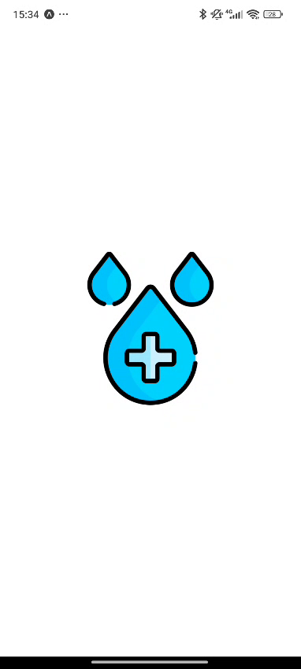

# Tutorial: Criando um Aplicativo de Lembrete de Água com React Native e Expo

Este tutorial guia você na criação de um aplicativo simples de lembrete de água usando **React Native** e **Expo**, com funcionalidades como contagem de copos, histórico, notificações e suporte a temas claro/escuro. Ao final, você terá um app funcional que pode ser personalizado e expandido conforme necessário.

## Tarefa

1. Faça o `fork` deste repositório para sua conta.
2. Clone o repositório para sua máquina.
3. Siga o tutorial abaixo para criar o aplicativo.
4. Resulva os desafios propostos no final do tutorial.
5. Faça `commit` e `push` das alterações para seu repositório.
6. Envie o link do seu repositório para o professor.

## Demonstração

Veja o aplicativo em ação no vídeo abaixo:

[](beber-agua.mp4)

---

## Pré-requisitos

Antes de começar, certifique-se de ter:
- Node.js instalado (versão 22 ou superior recomendada).
- Um editor de código (ex.: VS Code).
- Um dispositivo ou emulador para testar (Expo Go no celular ou emulador Android/iOS).

---

## Passo 1: Criando o Projeto

### 1.1. Iniciar o Projeto Expo
Crie um novo projeto com o comando abaixo:
```bash
npx create-expo-app AguaLembreteApp --template blank
cd AguaLembreteApp
```
- **Explicação Técnica**: O `--template blank` cria um projeto básico sem configurações extras, ideal para personalização.

### 1.2. Testar o Projeto Inicial
Execute o projeto para verificar se está funcionando:
```bash
npx expo start
# ou
npx expo start --tunnel # Em outra rede
```
- **Explicação Técnica**: Isso inicia o servidor Expo. Escaneie o QR code com o app Expo Go ou use um emulador para ver a tela padrão.

---

## Passo 2: Instalando Dependências

Instale as bibliotecas necessárias para as funcionalidades do app em comandos separados para maior clareza.

### 2.1. Navegação com Expo Router
```bash
npx expo install expo-router react-native-safe-area-context react-native-screens expo-linking expo-constants expo-status-bar
```
- **Explicação Técnica**: 
  - `expo-router`: Navegação baseada em arquivos.
  - `react-native-safe-area-context` e `react-native-screens`: Suporte a áreas seguras e telas nativas.
  - `expo-linking`, `expo-constants`, `expo-status-bar`: Configurações de links, constantes e barra de status.

### 2.2. Notificações e Armazenamento
```bash
npx expo install expo-notifications @react-native-async-storage/async-storage
```
- **Explicação Técnica**: 
  - `expo-notifications`: Para lembretes periódicos.
  - `@react-native-async-storage/async-storage`: Armazenamento local de dados.

> **Nota**: [Consulte a documentação oficial do Expo para mais detalhes sobre notificações](https://docs.expo.dev/versions/latest/sdk/notifications/).

<!-- ### 2.3. Splash Screen
```bash
npx expo install expo-splash-screen
```
- **Explicação Técnica**: Permite personalizar e controlar a splash screen. -->

### 2.3. Slider para Configurações
```bash
npx expo install @react-native-community/slider
```
- **Explicação Técnica**: Componente slider para ajustar o intervalo de notificações.

> **Nota**: [Consulte a documentação oficial do componente para mais detalhes](https://www.npmjs.com/package/@react-native-community/slider).

---

## Passo 3: Configurando o Projeto

### 3.1. Atualizar o `app.json`
Adicione configurações básicas ao `app.json`. Você precisa adicionar o `scheme`, `extra` e `plugins`:
```json
{
  "expo": {
    "scheme": "agualembrete",
    "name": "AguaLembrete",
    "version": "1.0.0",
    "extra": {
      "equipe": [
        "Desenvolvedor: João Silva",
        "Designer: Maria Santos",
        "Suporte: Pedro Costa"
      ]
    }
    "plugins": [
      "expo-router",
      [
        "expo-notifications",
        {
          "icon": "./assets/icon.png",
          "color": "#ffffff",
          "defaultChannel": "default",
          "enableBackgroundRemoteNotifications": false
        }
      ],
    ]
  }
}
```
- **Explicação Técnica**: 
  - `scheme`: Define um identificador para deep linking, necessário para o `expo-router`.
  - `extra.equipe`: Dados personalizados acessíveis via `Constants.expoConfig.extra`.
  - `plugins`: Configuração do `expo-notifications` com ícone e cor padrão.

### 3.2. Criar Estrutura de Pastas
Organize o projeto com a seguinte estrutura:
```
AguaLembreteApp/
├── app/
│   ├── _layout.jsx
│   ├── index.jsx
│   ├── history.jsx
│   ├── settings/
│   │   ├── _layout.jsx
│   │   ├── index.jsx
│   │   ├── about.jsx
├── components/
│   ├── agua_contador.jsx
├── utils/
│   ├── notifications.js
│   ├── ThemeContext.js
├── app.json
```

- **Explicação Técnica**: 
  - `app/`: Diretório principal para rotas do `expo-router`.
  - `settings/`: Subdiretório para navegação aninhada.
  - `components/` e `utils/`: Para componentes reutilizáveis e utilitários.

### 3.3. Modificando Assets

Na pasta `assets/`, substitua as 3 imagens padrão por ícones personalizados:
- `icon.png`: Ícone principal do app.
- `splash-icon.png`: Imagem da splash screen.
- `adaptarive-icon.png`: Ícone adaptativo para Android.

> **Dica**: Busque por um ícone de água ou copo para representar o app.

---

## Passo 4: Implementando o Código

Vamos começar a implementar o código do aplicativo, começando com o layout raiz, tema e tela inicial.

### 4.1. Tema com `ThemeContext` (`utils/ThemeContext.js`)

Antes de prosseguir, é importante estudar o uso de **Context API** em React Native. Vamos ver uma [explicação rápida](contexto.md) e depois implementar o contexto de tema para o app.

#### Definição dos Temas

Para começar, defina as cores para os modos claro e escuro. Aqui está um exemplo com cores que serão usadas no app. Veja que definimos parâmetros com mesmo nome para ambos os temas, mas com valores diferentes.

```jsx
export const themes = {
  light: {
    background: "#E3F2FD",
    cardBackground: "#FFF",
    primary: "#2196F3",
    primaryDark: "#1976D2",
    text: "#333",
    secondaryText: "#666",
    error: "#D32F2F",
    tabBarBackground: "#FFF",
    tabBarBorder: "#E3F2FD",
    headerColor: "#fff"
  },
  dark: {
    background: "#1E1E1E",
    cardBackground: "#2C2C2C",
    primary: "#42A5F5",
    primaryDark: "#90CAF9",
    text: "#E0E0E0",
    secondaryText: "#B0B0B0",
    error: "#EF5350",
    tabBarBackground: "#2C2C2C",
    tabBarBorder: "#424242",
    headerColor: "#2C2C2C"
  }
};
```

#### Contexto e Provedor

Agora, vamos criar o contexto e o provedor para gerenciar o tema do app. O provedor inicializa o tema com base no esquema de cores do sistema e salva a escolha do usuário no armazenamento local usando `AsyncStorage`.

```jsx
import React, { createContext, useContext, useState, useEffect } from "react";
import { useColorScheme } from "react-native";
import AsyncStorage from "@react-native-async-storage/async-storage";

const SETTINGS_PATH = "beberagua:notificationSettings";
const ThemeContext = createContext();

export const ThemeProvider = ({ children }) => {
  const systemColorScheme = useColorScheme();
  const [themeName, setThemeName] = useState(systemColorScheme || "light");
  const theme = themes[themeName];

  useEffect(() => {
    const loadTheme = async () => {
      try {
        const savedSettings = await AsyncStorage.getItem(SETTINGS_PATH);
        const settings = savedSettings ? JSON.parse(savedSettings) : {};
        setThemeName(settings.theme || systemColorScheme || "light");
      } catch (error) {
        console.error("Erro ao carregar tema:", error);
        setThemeName(systemColorScheme || "light");
      }
    };
    loadTheme();
  }, []);

  const setTheme = async (newTheme) => {
    setThemeName(newTheme);
    try {
      const savedSettings = await AsyncStorage.getItem(SETTINGS_PATH);
      const settings = savedSettings ? JSON.parse(savedSettings) : {};
      await AsyncStorage.setItem(SETTINGS_PATH, JSON.stringify({ ...settings, theme: newTheme }));
    } catch (error) {
      console.error("Erro ao salvar tema:", error);
    }
  };

  return (
    <ThemeContext.Provider value={{ theme, setTheme }}>
      {children}
    </ThemeContext.Provider>
  );
};

export const useTheme = () => useContext(ThemeContext);
```
- **Explicação Técnica**: 
  - `ThemeContext`: Cria um contexto para o tema.
  - `ThemeProvider`: Usa `useColorScheme` para inicializar o tema e `AsyncStorage` para persistência.
  - `useTheme`: Hook para acessar o tema e a função de mudança.
  - `themes`: Define cores para os modos claro e escuro.
  - `loadTheme`: Carrega o tema salvo ou usa o esquema padrão do sistema.
  - `setTheme`: Função para mudar o tema manualmente e salvar a escolha.

Veja que estamos exportando duas funções: `ThemeProvider` e `useTheme`. A primeira é um componente que envolve a aplicação para fornecer o tema, enquanto a segunda é um hook que pode ser usado em qualquer componente para acessar o tema e a função de mudança. O `ThemeProvider` será usado no layout raiz do app.

---

### 4.2. Layout Raiz com Splash Screen e Tabs (`app/_layout.jsx`)

Vamos criar um layout raiz para o aplicativo que exibe uma splash screen com mensagens motivacionais sobre hidratação e, em seguida, navega para as abas principais do app. Este layout é responsável por controlar o estado de carregamento do app e alternar entre a splash screen e as tabs.

#### **Importações e Mensagens**

Vamos usar o componente `Tabs` do Expo Router para criar a navegação por abas. Além disso, importaremos componentes nativos do React Native, hooks do React e o provedor de tema criado anteriormente. Também definiremos mensagens motivacionais sobre hidratação para exibir na splash screen.

```jsx
import { Tabs } from "expo-router";
import { StyleSheet, View, Text, TouchableOpacity } from "react-native";
import { useState, useCallback } from "react";
import { ThemeProvider, useTheme } from "../utils/ThemeContext";

const hydrationMessages = [
  { title: "💧 Hidratação é Vida 💧", text: "Beber água melhora sua concentração e mantém seu cérebro afiado!" },
  { title: "💧 Água é Saúde 💧", text: "A hidratação adequada ajuda na digestão e regula seu corpo!" },
  { title: "💧 Fique Hidratado 💧", text: "Água mantém sua pele saudável e radiante todos os dias!" },
  { title: "💧 Vida em Movimento 💧", text: "Beber água regularmente dá energia para suas atividades!" },
  { title: "💧 Equilíbrio Natural 💧", text: "A água regula sua temperatura corporal em qualquer clima!" },
];
```
- **Explicação**:
  - **`import { Tabs } from "expo-router";`**: Importa o componente `Tabs` do Expo Router, que é usado para criar uma navegação baseada em abas (tabs) no aplicativo.
  - **`import { StyleSheet, View, Text, TouchableOpacity } from "react-native";`**: Importa componentes nativos do React Native para construir a UI (estilização, contêineres, texto e botões interativos).
  - **`import { useState, useCallback } from "react";`**: Importa hooks do React:
    - `useState`: Para gerenciar o estado (neste caso, se o app está pronto ou não).
    - `useCallback`: Para memoizar a função que altera o estado, evitando recriações desnecessárias.
  - **`import { ThemeProvider, useTheme } from "../utils/ThemeContext";`**: Importa o provedor de tema (`ThemeProvider`) e o hook `useTheme` de um contexto personalizado definido em outro arquivo (`ThemeContext`), permitindo o uso de temas dinâmicos (ex.: claro/escuro).
  - **`const hydrationMessages`**: Um array de objetos contendo mensagens motivacionais sobre hidratação. Cada objeto tem um `title` (título) e um `text` (descrição). Essas mensagens são exibidas aleatoriamente na splash screen.

---

#### **Estrutura Principal**

Ainda em `app/_layout.jsx`, vamos definir o layout raiz do aplicativo, que envolve o conteúdo principal com o `ThemeProvider` para garantir que todos os componentes filhos tenham acesso ao contexto de tema. O conteúdo principal é um componente chamado `AppContent`, que exibe a splash screen ou as tabs com base no estado `appIsReady`. Em resumo, enquanto o usuário não clicar no botão "Vamos Começar", a splash screen será exibida; após clicar, as tabs serão mostradas.

```jsx
export default function RootLayout() {
  return (
    <ThemeProvider>
      <AppContent />
    </ThemeProvider>
  );
}

function AppContent() {
  const [appIsReady, setAppIsReady] = useState(false);
  const randomMessage = hydrationMessages[Math.floor(Math.random() * hydrationMessages.length)];
  const { theme } = useTheme();

  // useCallback: Memoiza a função para evitar recriações desnecessárias
  const onContinue = useCallback(async () => {
    setAppIsReady(true);
  }, []);

  if (!appIsReady) {
    return (
      <View style={[styles.splashContainer, { backgroundColor: theme.background }]}>
        <View style={[styles.splashCard, { backgroundColor: theme.cardBackground }]}>
          <Text style={[styles.splashTitle, { color: theme.primaryDark }]}>
            {randomMessage.title}
          </Text>
          <Text style={[styles.splashText, { color: theme.secondaryText }]}>
            {randomMessage.text}
          </Text>
        </View>
        <TouchableOpacity onPress={onContinue} style={[styles.button, { borderColor: theme.primary }]}>
          <Text style={[styles.buttonText, { color: theme.primary }]}>Vamos Começar</Text>
        </TouchableOpacity>
      </View>
    );
  }

  return <TabsLayout />;
}
```
- **Explicação**:
  - **`RootLayout`**:
    - Esta é a função principal exportada do arquivo, que define o layout raiz do aplicativo.
    - Ela envolve o conteúdo do app (`AppContent`) com o `ThemeProvider`, garantindo que todos os componentes filhos tenham acesso ao contexto de tema.
  - **`AppContent`**:
    - Define o conteúdo principal do aplicativo, que pode ser a splash screen ou as tabs, dependendo do estado `appIsReady`.
    - **`const [appIsReady, setAppIsReady] = useState(false);`**: Cria um estado booleano `appIsReady` inicializado como `false`. Quando falso, exibe a splash screen; quando verdadeiro, exibe as tabs.
    - **`const randomMessage = ...;`**: Seleciona aleatoriamente uma mensagem de `hydrationMessages` usando `Math.random()` e `Math.floor()` para garantir um índice inteiro válido.
    - **`const { theme } = useTheme();`**: Usa o hook `useTheme` para acessar o objeto `theme` do contexto, que contém propriedades como `background`, `primary`, `secondaryText`, etc.
    - **`const onContinue = useCallback(async () => { setAppIsReady(true); }, []);`**: Define uma função memoizada que altera `appIsReady` para `true` quando chamada. O array de dependências vazio (`[]`) indica que a função não depende de nenhuma variável externa e não será recriada em re-renderizações.
    - **Condição `if (!appIsReady)`**:
      - Se `appIsReady` for `false`, renderiza a splash screen:
        - **`View style={[styles.splashContainer, { backgroundColor: theme.background }]`**: Um contêiner principal que ocupa toda a tela (graças ao `flex: 1` nos estilos) com fundo dinâmico baseado no tema.
        - **`View style={[styles.splashCard, { backgroundColor: theme.cardBackground }]`**: Um "cartão" centralizado com bordas arredondadas e sombra, também com fundo dinâmico.
        - **`Text style={[styles.splashTitle, { color: theme.primaryDark }]`**: Exibe o título da mensagem aleatória com cor ajustada pelo tema.
        - **`Text style={[styles.splashText, { color: theme.secondaryText }]`**: Exibe o texto da mensagem com outra cor temática.
        - **`TouchableOpacity onPress={onContinue}`**: Um botão interativo que, ao ser pressionado, chama `onContinue` para mudar o estado e avançar para as tabs.
      - Se `appIsReady` for `true`, retorna o componente `<TabsLayout />`, que define a navegação por abas.

---

#### **Navegação por Tabs**

Ainda em `app/_layout.jsx`, vamos definir a navegação por abas usando o componente `Tabs` do Expo Router. Este componente contém três abas principais: "Início", "Histórico" e "Configurações", cada uma com um ícone e título correspondente. Também estamos usando o hook `useTheme` para acessar o tema e estilizar as abas dinamicamente.

```jsx
const TabsLayout = () => {
  const { theme } = useTheme();
  return (
    <Tabs
      screenOptions={{
        tabBarActiveTintColor: theme.primary,
        tabBarInactiveTintColor: theme.secondaryText,
        tabBarStyle: [styles.tabBar, { backgroundColor: theme.tabBarBackground, borderTopColor: theme.tabBarBorder }],
        headerShown: false,
      }}
    >
      <Tabs.Screen
        name="index"
        options={{
          title: "Início",
          tabBarIcon: ({ color }) => <Text style={[styles.tabIcon, { color }]}>🏠</Text>,
        }}
      />
      <Tabs.Screen
        name="history"
        options={{
          title: "Histórico",
          tabBarIcon: ({ color }) => <Text style={[styles.tabIcon, { color }]}>📜</Text>,
        }}
      />
      <Tabs.Screen
        name="settings"
        options={{
          title: "Configurações",
          tabBarIcon: ({ color }) => <Text style={[styles.tabIcon, { color }]}>⚙️</Text>,
        }}
      />
    </Tabs>
  );
};
```
- **Explicação**:
  - **`TabsLayout`**:
    - Define a navegação por abas usando o componente `Tabs` do Expo Router.
    - **`const { theme } = useTheme();`**: Acessa o tema novamente para estilizar as tabs dinamicamente.
    - **`Tabs screenOptions={{ ... }}`**: Configura opções globais para todas as abas:
      - `tabBarActiveTintColor`: Cor do ícone/texto da aba ativa (usa `theme.primary`).
      - `tabBarInactiveTintColor`: Cor das abas inativas (usa `theme.secondaryText`).
      - `tabBarStyle`: Estilo da barra de navegação, combinando estilos fixos (`styles.tabBar`) com propriedades dinâmicas como cor de fundo e borda.
      - `headerShown: false`: Esconde o cabeçalho padrão de cada tela para uma UI mais limpa.
    - **`Tabs.Screen`**:
      - Define três telas: "Início" (`index`), "Histórico" (`history`) e "Configurações" (`settings`).
      - Cada tela tem:
        - `name`: O nome do arquivo correspondente no diretório `app/` (ex.: `index.jsx` para "Início").
        - `options`:
          - `title`: O texto exibido na aba.
          - `tabBarIcon`: Uma função que retorna um ícone (neste caso, um emoji dentro de um `Text`) com cor dinâmica baseada no estado ativo/inativo da aba.

---

#### **Estilos**

Por fim, vamos definir os estilos para a splash screen, as abas e os ícones das abas. Esses estilos são usados para personalizar a aparência do app, incluindo cores, tamanhos de fonte, espaçamentos e sombras.

```jsx
const styles = StyleSheet.create({
  splashContainer: {
    flex: 1,
    justifyContent: "space-evenly",
    alignItems: "center",
  },
  splashCard: {
    borderRadius: 15,
    padding: 25,
    alignItems: "center",
    shadowColor: "#000",
    shadowOffset: { width: 0, height: 2 },
    shadowOpacity: 0.1,
    shadowRadius: 8,
    elevation: 5,
    width: "85%",
  },
  splashTitle: {
    fontSize: 26,
    fontWeight: "bold",
    marginBottom: 15,
    textAlign: "center",
  },
  splashText: {
    fontSize: 16,
    textAlign: "center",
    marginBottom: 25,
    lineHeight: 22,
  },
  button: {
    borderRadius: 10,
    padding: 15,
    borderWidth: 4,
  },
  buttonText: {
    fontSize: 20,
    fontWeight: "bold",
  },
  tabBar: {
    borderTopWidth: 1,
    paddingBottom: 5,
    paddingTop: 5,
  },
  tabIcon: {
    fontSize: 24,
  },
});
```
- **Explicação**:
  - **`splashContainer`**: Estiliza o contêiner da splash screen para ocupar toda a tela (`flex: 1`) e centralizar os elementos com espaçamento uniforme (`space-evenly`).
  - **`splashCard`**: Define o "cartão" da splash screen com bordas arredondadas, sombra suave (via `shadow*` e `elevation`) e largura de 85% da tela.
  - **`splashTitle`**: Estilo do título com fonte grande e negrito, centralizado.
  - **`splashText`**: Estilo do texto com fonte menor, espaçamento de linha ajustado (`lineHeight`) e centralização.
  - **`button`**: Estilo do botão com borda, bordas arredondadas e padding.
  - **`buttonText`**: Texto do botão com fonte grande e negrito.
  - **`tabBar`**: Estilo da barra de navegação com borda superior e padding vertical.
  - **`tabIcon`**: Estilo dos ícones das abas (emojis) com tamanho de fonte definido.

---


### 4.4. Componente `AguaContador` (`components/agua_contador.jsx`)

Vamos criar um componente reutilizável para exibir um contador de copos de água e permitir que o usuário adicione copos ao longo do dia. O contador é salvo localmente usando `AsyncStorage` e atualizado automaticamente ao voltar para a tela.

#### Importações e Configuração

Vamos importar `AsyncStorage` e o hook `useTheme` para acessar o tema no componente. Também definiremos uma constante `HISTORICO_AGUA` para o nome da chave usada para salvar o histórico de consumo de água.

```jsx
import React from "react";
import { StyleSheet, View, Text, Button } from "react-native";
import AsyncStorage from "@react-native-async-storage/async-storage";
import { useTheme } from "../utils/ThemeContext";

const HISTORICO_AGUA = "waterHistory";
```

#### Lógica e Interface

Basicamente, este componente recebe as propriedades `copos` e `setCopos` para controlar o contador de copos de água. Quando o usuário clica no botão "Bebi um copo!", o contador é incrementado e o histórico é salvo no `AsyncStorage`. O layout é composto por um cartão com texto, botão e contador.

```jsx
export default function AguaContador({ copos, setCopos }) {
  const { theme } = useTheme();

  const adicionar = async () => {
    const dtAtual = new Date().toLocaleDateString("pt-BR");
    setCopos(copos + 1);
    try {
      const historico = await AsyncStorage.getItem(HISTORICO_AGUA);
      const lista = historico ? JSON.parse(historico) : [];
      const coposHoje = lista.find(entry => entry.date === dtAtual);
      if (coposHoje) {
        coposHoje.count += 1;
      } else {
        lista.push({ date: dtAtual, count: 1 });
      }
      await AsyncStorage.setItem(HISTORICO_AGUA, JSON.stringify(lista));
    } catch (e) {
      console.error("Erro ao salvar histórico:", e);
    }
  };

  return (
    <View style={[styles.counterCard, { backgroundColor: theme.cardBackground }]}>
      <View style={styles.cardContent}>
        <Text style={[styles.counterText, { color: theme.primaryDark }]}>
          Copos Hoje
        </Text>
        <Button title="Bebi um copo!" onPress={adicionar} color={theme.primary} />
      </View>
      <View style={styles.cardFooter}>
        <Text style={styles.counter}>{copos} 💧</Text>
      </View>
    </View>
  );
}
```

#### Estilos

Por fim, vamos definir os estilos para o componente `AguaContador`. Esses estilos são usados para personalizar a aparência do contador de copos de água, incluindo cores, tamanhos de fonte, espaçamentos e alinhamentos.

```jsx
const styles = StyleSheet.create({
  counterCard: {
    flexDirection: "row",
    padding: 20,
    alignItems: "center",
    justifyContent: "space-between",
  },
  cardContent: {
    flexDirection: "column",
    alignItems: "center",
    gap: 10,
  },
  counter: {
    fontSize: 46,
    fontWeight: "bold",
  },
  counterText: {
    fontSize: 24,
    fontWeight: "600",
  },
});
```
- **Explicação Técnica**: 
  - `adicionar`: Incrementa o contador e salva no `AsyncStorage`.
  - Layout horizontal com texto e botão à esquerda e contador à direita.

> **Nota**: Este componente é reutilizável e pode ser usado em várias telas do aplicativo para adicionar copos de água. A princípio, vamos usar na tela inicial (`index.jsx`).

---

### 4.3. Tela Inicial (`app/index.jsx`)

Agora, vamos criar a tela inicial do aplicativo, que exibe um contador de copos de água e permite ao usuário adicionar copos ao longo do dia. O contador é salvo localmente usando `AsyncStorage` e atualizado automaticamente ao voltar para a tela.

#### Importações e Configuração Inicial (`app/index.jsx`)

Dentre as importações, destaque para o uso do hook `useFocusEffect` do Expo Router para recarregar os dados ao voltar para a tela. Além disso, importamos funções auxiliares para configuração e atualização de notificações, bem como o hook `useTheme` para acessar o tema no componente. O componente `AguaContador` também é importado para exibir o contador de copos de água.

```jsx
import React, { useState, useEffect, useCallback } from "react";
import { StyleSheet, View, Text } from "react-native";
import { useFocusEffect } from "expo-router";
import AsyncStorage from "@react-native-async-storage/async-storage";
import AguaContador from "../components/agua_contador";
import { setupNotifications, updateNotifications } from "../utils/notifications";
import { useTheme } from "../utils/ThemeContext";

const HISTORICO_AGUA = "waterHistory"; // Mesma chave usada no componente AguaContador
```

#### Lógica Principal
```jsx
export default function HomeScreen() {
  const { theme } = useTheme();
  const [copos, setCopos] = useState(0);

  useEffect(() => {
    const initialize = async () => {
      await setupNotifications();
      await carregar();
      await updateNotifications();
    };
    initialize();
  }, []);

  useFocusEffect(
    useCallback(() => {
      const recarregarAoVoltar = async () => {
        await carregar();
      };
      recarregarAoVoltar();
    }, [])
  );

  // Carregar histórico de consumo de água hoje e atualizar o contador
  const carregar = async () => {
    try {
      const historico_salvo = await AsyncStorage.getItem(HISTORICO_AGUA);
      const historico_parsed = historico_salvo ? JSON.parse(historico_salvo) : [];
      const dtAtual = new Date().toLocaleDateString("pt-BR");
      const coposHoje = historico_parsed.find(entry => entry.date === dtAtual);
      setCopos(coposHoje ? coposHoje.count : 0);
    } catch (e) {
      console.error("Erro ao carregar contagem do dia:", e);
    }
  };

  return (
    <View style={[styles.container, { backgroundColor: theme.background }]}>
      <Text style={[styles.title, { color: theme.primaryDark }]}>
        Lembrete de Água
      </Text>
      <AguaContador copos={copos} setCopos={setCopos} />
    </View>
  );
}
```

- **Explicação Técnica**: 
  - `initialize`: Configura notificações e carrega o histórico ao iniciar.
  - `recarregarAoVoltar`: Recarrega os dados ao voltar para a tela. Útil para atualizar o contador ao limpar o histórico na tela de histórico.
  - `carregar`: Carrega o histórico de consumo de água e atualiza o contador de copos. Estamos filtrando os dados por data atual e exibindo o total de copos bebidos hoje.
  - Layout com título e componente `AguaContador`.

#### Estilos
```jsx
const styles = StyleSheet.create({
  container: {
    flex: 1,
    padding: 15,
    justifyContent: "flex-start",
  },
  title: {
    fontSize: 32,
    fontWeight: "bold",
    textAlign: "center",
    marginTop: 10,
    marginBottom: 20,
  },
});
```
- **Explicação Técnica**: 
  - `useEffect`: Configura notificações e carrega o histórico ao iniciar.
  - `useFocusEffect`: Recarrega os dados ao voltar para a tela.
  - `AguaContador`: Componente para adicionar copos.

---

### 4.5. Tela de Histórico (`app/history.jsx`)

Agora, vamos criar a tela de histórico do aplicativo, que exibe uma lista de registros de consumo de água ordenados por data. O histórico é salvo localmente usando `AsyncStorage` e atualizado automaticamente ao voltar para a tela.

#### Importações e Configuração
```jsx
// app/history.jsx
import React, { useState, useCallback, useEffect } from "react";
import {
  StyleSheet,
  View,
  Text,
  FlatList,
  TouchableOpacity,
  Alert,
} from "react-native";
import AsyncStorage from "@react-native-async-storage/async-storage";
import { useTheme } from "../utils/ThemeContext";
import { useFocusEffect } from "expo-router";

const HISTORICO_AGUA = "waterHistory"; // Mesma chave usada no componente AguaContador
```

#### Lógica Principal (`app/history.jsx`)
```jsx
export default function HistoryScreen() {
  const { theme } = useTheme();
  const [historico, setHistorico] = useState([]);

  // useEffect(() => {
  //   carregar();
  // }, []);

  useFocusEffect(
    useCallback(() => {
      carregar();
    }, [])
  );

  const ordenarHistorico = (a, b) => {
    const [diaA, mesA, anoA] = a.date.split("/");
    const [diaB, mesB, anoB] = b.date.split("/");
    return new Date(anoB, mesB - 1, diaB) - new Date(anoA, mesA - 1, diaA);
  };

  const carregar = async () => {
    try {
      const savedHistory = await AsyncStorage.getItem(HISTORICO_AGUA);
      if (savedHistory) {
        const parsed = JSON.parse(savedHistory);
        const ordenado = parsed.sort(ordenarHistorico);
        setHistorico(ordenado);
      }
    } catch (e) {
      console.error("Erro ao carregar histórico:", e);
    }
  };

  const limparHistorico = () => {
    Alert.alert(
      "Limpar Histórico",
      "Tem certeza que deseja limpar todo o histórico de consumo?",
      [
        { text: "Cancelar", style: "cancel" },
        {
          text: "Limpar",
          onPress: async () => {
            await AsyncStorage.removeItem(HISTORICO_AGUA);
            setHistorico([]);
          },
          style: "destructive",
        },
      ]
    );
  };
```

- **Explicação Técnica**: 
  - `ordenarHistorico`: Função de comparação para ordenar o histórico por data decrescente.
  - `carregar`: Carrega o histórico de consumo de água e ordena por data.
  - `limparHistorico`: Limpa o histórico de consumo de água após confirmação do usuário.
  - `useFocusEffect`: Recarrega os dados ao voltar para a tela, não apenas ao iniciar.

#### Renderização (`app/history.jsx`)
```jsx
  const renderHistoryItem = ({ item }) => (
    <View style={[styles.historyItem, { backgroundColor: theme.cardBackground }]}>
      <Text style={[styles.historyText, { color: theme.secondaryText }]}>
        {item.date}: {item.count} copo(s) 💧
      </Text>
    </View>
  );

  return (
    <View style={[styles.container, { backgroundColor: theme.background }]}>
      <Text style={[styles.title, { color: theme.primaryDark }]}>
        Histórico de Consumo
      </Text>
      <TouchableOpacity style={styles.limparButton} onPress={limparHistorico}>
        <Text style={styles.limparButtonText}>Limpar Histórico</Text>
      </TouchableOpacity>
      <FlatList
        data={historico}
        renderItem={renderHistoryItem}
        keyExtractor={item => item.date}
        style={styles.historyList}
        contentContainerStyle={styles.historyContent}
        ListEmptyComponent={() => (
          <View style={styles.emptyContainer}>
            <Text style={[styles.emptyText, { color: theme.secondaryText }]}>
              Nenhum registro de consumo encontrado
            </Text>
          </View>
        )}
      />
    </View>
  );
}
```

- **Explicação Técnica**: 
  - `renderHistoryItem`: Renderiza um item do histórico com data e contagem de copos.
  - `TouchableOpacity`: Botão para limpar o histórico de consumo.
  - `FlatList`: Lista de registros de consumo de água.
  - `ListEmptyComponent`: Componente exibido quando o histórico está vazio.

#### Estilos (`app/history.jsx`)
```jsx
const styles = StyleSheet.create({
  container: {
    flex: 1,
    padding: 20,
  },
  title: {
    fontSize: 28,
    fontWeight: "bold",
    textAlign: "center",
    marginVertical: 20,
  },
  historyList: {
    flex: 1,
  },
  historyContent: {
    paddingBottom: 20,
  },
  historyItem: {
    borderRadius: 10,
    padding: 15,
    marginBottom: 10,
    shadowColor: "#000",
    shadowOffset: { width: 0, height: 1 },
    shadowOpacity: 0.1,
    shadowRadius: 5,
    elevation: 3,
  },
  historyText: {
    fontSize: 16,
  },
  limparButton: {
    backgroundColor: "#FF5252",
    borderRadius: 10,
    padding: 12,
    marginBottom: 20,
    alignItems: "center",
  },
  limparButtonText: {
    color: "#FFF",
    fontWeight: "bold",
    fontSize: 16,
  },
  emptyContainer: {
    flex: 1,
    justifyContent: "center",
    alignItems: "center",
  },
  emptyText: {
    fontSize: 16,
    textAlign: "center",
  },
});
```

---

### 4.6. Layout de Configurações (`app/settings/_layout.jsx`)

O arquivo `_layout.jsx` dentro da pasta `app/settings/` define a estrutura do layout das telas relacionadas às configurações no aplicativo. Ele organiza a navegação entre as telas que estão dentro da pasta `app/settings/`. Começamos importando os componentes e hooks necessários, como `Stack` e `Link` do Expo Router, `StyleSheet` e `Text` do React Native, e o hook `useTheme` para acessar o tema.

```jsx
import { Stack } from "expo-router";
import { StyleSheet, Text } from "react-native";
import { Link } from "expo-router";
import { useTheme } from "../../utils/ThemeContext";
```

Em seguida, definimos o layout principal para as telas de configurações, que incluem a tela inicial de configurações e a tela "Sobre". O layout é composto por um `Stack` que contém duas telas: "index" (configurações) e "about" (sobre).

```jsx
export default function SettingsLayout() {
  const { theme } = useTheme();

  return (
    <Stack
      screenOptions={{
        headerStyle: [styles.header, { backgroundColor: theme.primary }],
        headerTintColor: theme.headerColor,
        headerTitleStyle: styles.headerTitle,
      }}
    >
      <Stack.Screen
        name="index"
        options={{
          title: "Configurações",
          headerRight: () => (
            <Link href="/settings/about" asChild>
              <Text style={styles.headerIcon}>📄</Text>
            </Link>
          ),
        }}
      />
      <Stack.Screen name="about" options={{ title: "Sobre" }} />
    </Stack>
  );
}
```

- **Explicação Técnica**: 
  - `Stack`: Navegação aninhada para "Configurações" e "Sobre".
  - `headerRight`: Link para "Sobre" no cabeçalho. Usamos `asChild` para que seja habilitado ícone de voltar na próxima tela.

> **Nota**: Para navegar até a tela "Sobre", usamos um ícone de documento (`📄`) no cabeçalho da tela de configurações. Ao clicar no ícone, o usuário será redirecionado para a tela "Sobre".

#### Estilos (`app/settings/_layout.jsx`)

Os estilos são simples, criados apenas para personalizar o cabeçalho.

```jsx
const styles = StyleSheet.create({
  headerTitle: {
    fontWeight: "bold",
    fontSize: 20,
  },
  headerIcon: {
    fontSize: 22,
  },
});
```

---

### 4.7. Tela de Configurações (`app/settings/index.jsx`)

A tela de configurações têm três funcionalidades:

1. **Modo Escuro**: Permite ao usuário alternar entre os temas claro e escuro.
2. **Notificações**: Ativa/desativa as notificações de lembrete de água.
3. **Intervalo de Notificação**: Define o intervalo de tempo entre as notificações.

As configurações são persistidas com `AsyncStorage` e atualizadas automaticamente ao alterar os valores, sem a necessidade de um botão "Salvar".

#### Importações e Configuração (`app/settings/index.jsx`)
```jsx
import React, { useState, useEffect } from "react";
import { StyleSheet, View, Text, Switch, ActivityIndicator } from "react-native";
import AsyncStorage from "@react-native-async-storage/async-storage";
import { updateNotifications } from "../../utils/notifications";
import Slider from "@react-native-community/slider";
import { useTheme, themes } from "../../utils/ThemeContext";

const SETTINGS_PATH = "beberagua:notificationSettings";
const INTERVAL_MIN = 0.01;
const INTERVAL_MAX = 4;
const INTERVAL_STEP = 0.01;
```

#### Lógica Principal (`app/settings/index.jsx`)
```jsx
export default function SettingsScreen() {
  const [notificationsEnabled, setNotificationsEnabled] = useState(true);
  const [interval, setInterval] = useState(null);
  const [isLoading, setIsLoading] = useState(true);
  const { theme, setTheme } = useTheme();
  const [isDarkMode, setIsDarkMode] = useState(theme === themes.dark);

  const toggleTheme = (value) => {
    setIsDarkMode(value);
    setTheme(value ? "dark" : "light");
  };

  useEffect(() => {
    loadSettings();
  }, []);

  useEffect(() => {
    if (!isLoading) {
      saveSettings();
    }
  }, [isDarkMode, notificationsEnabled, interval]);

  const loadSettings = async () => {
    try {
      const savedSettings = await AsyncStorage.getItem(SETTINGS_PATH);
      if (savedSettings) {
        const { enabled, interval: savedInterval, theme: savedTheme } = JSON.parse(savedSettings);
        setNotificationsEnabled(enabled);
        setInterval(parseFloat(savedInterval) || 1);
        setIsDarkMode(savedTheme === "dark");
        if (savedTheme) setTheme(savedTheme);
      } else {
        setInterval(1);
      }
    } catch (e) {
      console.error("Erro ao carregar configurações:", e);
      setInterval(1);
    } finally {
      setIsLoading(false);
    }
  };

  const saveSettings = async () => {
    try {
      const settings = {
        enabled: notificationsEnabled,
        interval: interval,
        theme: isDarkMode ? "dark" : "light",
      };
      await AsyncStorage.setItem(SETTINGS_PATH, JSON.stringify(settings));
      await updateNotifications();
    } catch (e) {
      console.error("Erro ao salvar configurações:", e);
    }
  };

  if (isLoading) {
    return (
      <View style={styles.loadingContainer}>
        <ActivityIndicator size="large" color={theme.primary} />
      </View>
    );
  }
```

- **Explicação Técnica**: 
  - `toggleTheme`: Alterna entre os temas claro e escuro.
  - `loadSettings`: Carrega as configurações salvas no `AsyncStorage`.
  - `saveSettings`: Salva as configurações no `AsyncStorage` e atualiza as notificações.
  - `useEffect`: Carrega as configurações ao iniciar e salva ao alterar os valores.
  - `ActivityIndicator`: Exibe um indicador de carregamento enquanto as configurações são carregadas.

#### Interface (`app/settings/index.jsx`)
```jsx
  return (
    <View style={[styles.container, { backgroundColor: theme.background }]}>
      <View style={[styles.card, { backgroundColor: theme.cardBackground }]}>
        <View style={styles.setting}>
          <Text style={[styles.label, { color: theme.secondaryText }]}>
            Modo Escuro
          </Text>
          <Switch
            value={isDarkMode}
            onValueChange={toggleTheme}
            trackColor={{ false: "#ccc", true: theme.primary }}
            thumbColor={isDarkMode ? theme.primaryDark : "#f4f3f4"}
          />
        </View>
        <View style={styles.setting}>
          <Text style={[styles.label, { color: theme.secondaryText }]}>
            Notificações
          </Text>
          <Switch
            value={notificationsEnabled}
            onValueChange={setNotificationsEnabled}
            trackColor={{ false: "#ccc", true: theme.primary }}
            thumbColor={notificationsEnabled ? theme.primaryDark : "#f4f3f4"}
          />
        </View>
        <View style={styles.sliderContainer}>
          <Text style={[styles.label, { color: theme.secondaryText }]}>
            Intervalo: {interval?.toFixed(2)} hora(s)
          </Text>
          <Slider
            style={styles.slider}
            minimumValue={INTERVAL_MIN}
            maximumValue={INTERVAL_MAX}
            step={INTERVAL_STEP}
            value={interval}
            onValueChange={setInterval}
            minimumTrackTintColor={theme.primary}
            maximumTrackTintColor={theme.secondaryText}
            thumbTintColor={theme.primaryDark}
          />
        </View>
      </View>
    </View>
  );
}
```

#### Estilos (`app/settings/index.jsx`)
```jsx
const styles = StyleSheet.create({
  container: {
    flex: 1,
    padding: 15,
  },
  card: {
    borderRadius: 15,
    padding: 20,
    shadowColor: "#000",
    shadowOffset: { width: 0, height: 2 },
    shadowOpacity: 0.1,
    shadowRadius: 8,
    elevation: 5,
  },
  setting: {
    flexDirection: "row",
    justifyContent: "space-between",
    alignItems: "center",
    marginVertical: 15,
  },
  label: {
    fontSize: 18,
    fontWeight: "500",
  },
  sliderContainer: {
    marginVertical: 15,
  },
  slider: {
    width: "100%",
    height: 40,
  },
  loadingContainer: {
    flex: 1,
    justifyContent: "center",
    alignItems: "center",
  },
});
```

---

### 4.8. Tela Sobre (`app/settings/about.jsx`)

A tela "Sobre" exibe informações sobre a equipe de desenvolvimento, a versão do aplicativo e seu objetivo. Além disso, oferece um botão para compartilhar o aplicativo com amigos. As informações são obtidas do arquivo `app.json` e da constante `equipe` também definida no arquivo `app.json`.

#### Importações e Configuração (`app/settings/about.jsx`)
```jsx
import React from "react";
import { StyleSheet, View, Text, Share, TouchableOpacity } from "react-native";
import Constants from "expo-constants";
import { useTheme } from "../../utils/ThemeContext";

const equipe = Constants.expoConfig.extra.equipe;
```

Acesse o arquivo `app.json` e adicione a seguinte configuração:

```json
{
  "expo": {
    "extra": {
      "equipe": [
        "Desenvolvedor: NOME",
        "Designer: NOME",
        "Suporte: NOME"
      ]
    }
  }
}
```

#### Lógica e Interface (`app/settings/about.jsx`)
```jsx
export default function AboutScreen() {
  const { theme } = useTheme();

  const onShare = async () => {
    try {
      await Share.share(
        {
          message: "Experimente o Lembrete de Água! Um app simples para te ajudar a se manter hidratado todos os dias. Baixe agora em https://videira.ifc.edu.br",
          title: "Convide amigos para se hidratar!",
          url: "https://videira.ifc.edu.br",
        },
        { dialogTitle: "Compartilhar o Lembrete de Água" }
      );
    } catch (error) {
      console.error("Erro ao compartilhar:", error.message);
    }
  };

  return (
    <View style={[styles.container, { backgroundColor: theme.background }]}>
      <View style={[styles.card, { backgroundColor: theme.cardBackground }]}>
        <Text style={[styles.sectionTitle, { color: theme.primaryDark }]}>
          Equipe de Desenvolvimento
        </Text>
        {equipe?.map((member, index) => (
          <Text key={index} style={[styles.text, { color: theme.secondaryText }]}>
            {member}
          </Text>
        ))}
        <Text style={[styles.sectionTitle, { color: theme.primaryDark }]}>
          Versão
        </Text>
        <Text style={[styles.text, { color: theme.secondaryText }]}>
          {Constants.expoConfig.version}
        </Text>
        <Text style={[styles.sectionTitle, { color: theme.primaryDark }]}>
          Objetivo
        </Text>
        <Text style={[styles.text, { color: theme.secondaryText }]}>
          Este aplicativo foi criado para ajudar as pessoas a se manterem hidratadas,
          oferecendo lembretes regulares e um registro simples do consumo de água.
        </Text>
        <TouchableOpacity style={[styles.shareButton, { backgroundColor: theme.primary }]} onPress={onShare}>
          <Text style={styles.shareButtonText}>Compartilhar App 💧</Text>
        </TouchableOpacity>
      </View>
    </View>
  );
}
```

- **Explicação Técnica**: 
  - `onShare`: Usa `Share` para compartilhar um link.
  - Dados da equipe e versão vêm do `app.json` via `Constants`.

#### Estilos (`app/settings/about.jsx`)
```jsx
const styles = StyleSheet.create({
  container: {
    flex: 1,
    padding: 20,
  },
  card: {
    borderRadius: 15,
    padding: 20,
    shadowColor: "#000",
    shadowOffset: { width: 0, height: 2 },
    shadowOpacity: 0.1,
    shadowRadius: 8,
    elevation: 5,
  },
  sectionTitle: {
    fontSize: 20,
    fontWeight: "bold",
    marginTop: 15,
    marginBottom: 10,
  },
  text: {
    fontSize: 16,
    lineHeight: 24,
  },
  shareButton: {
    borderRadius: 10,
    paddingVertical: 12,
    paddingHorizontal: 20,
    marginTop: 20,
    alignItems: "center",
  },
  shareButtonText: {
    color: "#FFF",
    fontSize: 16,
    fontWeight: "bold",
  },
});
```

---

### 4.9. Utilitário de Notificações (`utils/notifications.js`)

Para gerenciar as notificações de lembrete de água, criamos um arquivo `notifications.js` dentro da pasta `utils/`. Este arquivo contém funções para configurar e atualizar as notificações, bem como constantes para armazenar as configurações de notificação.

Criamos 

#### Configuração Inicial (`utils/notifications.js`)
```jsx
import * as Notifications from "expo-notifications";
import AsyncStorage from "@react-native-async-storage/async-storage";

const SETTINGS_PATH = "beberagua:notificationSettings";

Notifications.setNotificationHandler({
  handleNotification: async () => ({
    shouldShowAlert: true,
    shouldPlaySound: true,
    shouldSetBadge: false,
  }),
});
```

#### Funções de Notificação (`utils/notifications.js`)

Aqui, definimos duas funções principais: `setupNotifications` e `updateNotifications`. A primeira solicita permissão para notificações e a segunda cancela e recria as notificações com base nas configurações salvas.

```jsx
export async function setupNotifications() {
  const { status } = await Notifications.requestPermissionsAsync();
  if (status !== "granted") {
    alert("Precisamos da permissão para enviar notificações!");
    return false;
  }
  return true;
}

export async function updateNotifications() {
  const settings = await AsyncStorage.getItem(SETTINGS_PATH);

  const defaltSettings = {
    enabled: true,
    interval: 1 * 60 * 60, // 1 hora
  };

  const { enabled, interval } = settings
    ? JSON.parse(settings)
    : defaltSettings;

  console.log("Intervalo  em Horas e Segundos:", interval, interval * 60 * 60);

  // Cancela todas as notificações agendadas
  await Notifications.cancelAllScheduledNotificationsAsync();

  // Recria notificações com base nas configurações salvas
  if (enabled) {
    await Notifications.scheduleNotificationAsync({
      content: {
        title: "Hora de beber água! 💧",
        body: "Mantenha-se hidratado! Que tal um copo de água agora?",
      },
      trigger: {
        seconds: interval * 60 * 60, // Convertendo horas para segundos
        repeats: true,
        type: Notifications.SchedulableTriggerInputTypes.TIME_INTERVAL,
      },
    });
  }
}

```
- **Explicação Técnica**: 
  - `setupNotifications`: Solicita permissão para notificações. 
  - `updateNotifications`: Cancela e recria notificações com base no intervalo.

---

## Passo 5: Testando o Aplicativo

### 5.1. Executar o App
```bash
npx expo start
# Ou, se estiver em outra rede:
npx expo start --tunnel
```

---

### Tarefa

Como desafio adicional, escolha pelo menos 3 desafios para implementar no aplicativo "AguaLembrete". 

#### Nível Básico
1. **Adicionar Meta Diária de Copos**
     - **Descrição**: Inclua uma configuração na tela de "Configurações" para que o usuário defina uma meta diária de copos de água (ex.: 8 copos). Na tela inicial (`index.jsx`), exiba a meta e o progresso (ex.: "5/8 copos").
     - **Dica**: Use `AsyncStorage` para salvar a meta e atualize o componente `AguaContador` para mostrar o progresso.

2. **Gráfico de Consumo**
   - **Descrição**: Adicione um gráfico simples na tela de "Histórico" (`history.jsx`) mostrando o consumo de água nos últimos 7 dias. Use uma biblioteca para criação do gráfico.
   - **Dica**: Filtre os dados do `AsyncStorage` para os últimos 7 dias e configure um gráfico de barras ou linhas.

3. **Registro de Quantidade de Água**
   - **Descrição**: Em vez de contar apenas copos, permita que o usuário registre a quantidade de água em mililitros (ex.: 250ml, 500ml) no componente `AguaContador`. Atualize o histórico para refletir isso.
   - **Dica**: Substitua o botão "Bebi um copo!" por um seletor ou entrada numérica e ajuste o formato no `AsyncStorage`.

4.  **Mudança de Cor dos Temas**
    - **Descrição**: Adicione uma opção na tela de "Configurações" para o usuário escolher a cor primária do tema (ex.: azul, verde, roxo) em vez de usar apenas as cores padrão (`primary` e `primaryDark`). Atualize o `ThemeContext` para refletir a escolha.
    - **Dica**: Crie um array de cores predefinidas no `ThemeContext.js` e use um componente como `Picker` ou botões para selecionar. Salve a escolha no `AsyncStorage`.
    - **Objetivo**: Praticar manipulação de estado e personalização de UI.

5.  **Som ao Adicionar Copo**
    - **Descrição**: Faça o aplicativo tocar um som simples (ex.: um "gota d'água") toda vez que o usuário clicar em "Bebi um copo!" no componente `AguaContador`.
    - **Dica**: Use a biblioteca `expo-av` (`npm install expo-av`) para reproduzir um arquivo de áudio colocado na pasta `assets/`.
    - **Objetivo**: Introduzir multimídia básica e interatividade sonora.

6.  **Mensagem de Boas-Vindas Personalizada**
    - **Descrição**: Na tela inicial (`index.jsx`), exiba uma mensagem de boas-vindas com o nome do usuário (ex.: "Olá, João! Vamos nos hidratar hoje?"). Permita que o nome seja configurado na tela de "Configurações".
    - **Dica**: Adicione um campo de texto em `settings/index.jsx` para o usuário inserir o nome e use `AsyncStorage` para persistir.
    - **Objetivo**: Trabalhar com entrada de texto e personalização.

7.  **Botão de Reiniciar o Dia**
    - **Descrição**: Adicione um botão na tela inicial (`index.jsx`) que permita ao usuário reiniciar o contador de copos do dia atual para zero, sem afetar o histórico.
    - **Dica**: Crie uma função que atualize apenas o contador do dia atual no `AsyncStorage` e chame-a com um `TouchableOpacity`.
    - **Objetivo**: Praticar manipulação de dados locais e interação com o usuário.

8.  **Indicador de Hora na Splash Screen**
    - **Descrição**: Na splash screen (`_layout.jsx`), exiba a hora atual do dispositivo junto com a mensagem motivacional (ex.: "10/03/2025 - 14:30").
    - **Dica**: Use `new Date().toLocaleString()` para obter a data e hora e atualize o componente com `useState` e `setInterval` para manter a hora em tempo real.
    - **Objetivo**: Introduzir manipulação de datas e atualização dinâmica.

9.  **Contagem de Dias Consecutivos**
    - **Descrição**: Na tela inicial (`index.jsx`), mostre quantos dias consecutivos o usuário registrou pelo menos um copo de água, baseado no histórico.
    - **Dica**: Analise o array do `AsyncStorage` em `carregar` para contar dias consecutivos e exiba o resultado em um `Text`.
    - **Objetivo**: Praticar lógica simples com arrays e feedback ao usuário.

10. **Botão de Ajuda**
    - **Descrição**: Adicione um botão flutuante (ex.: um ícone de "?") na tela inicial que exiba um alerta com instruções básicas sobre como usar o aplicativo.
    - **Dica**: Use `Alert.alert` do React Native e posicione o botão com `position: 'absolute'` nos estilos.
    - **Objetivo**: Praticar criação de alertas e posicionamento de elementos.


#### Nível Avançado
1. **Sincronização com a Nuvem**
   - **Descrição**: Implemente a sincronização do histórico de consumo de água com um serviço como Firebase ou Supabase, permitindo que os dados sejam salvos online e sincronizados entre dispositivos.
   - **Dica**: Configure uma conta no Firebase, use o Firestore para armazenar o histórico e adicione funções de login simples (email/senha ou anônimo).
   - **Objetivo**: Introduzir conceitos de backend e autenticação.

2. **Gamificação**
   - **Descrição**: Adicione um sistema de pontos ou níveis na tela inicial. Por exemplo, o usuário ganha 10 pontos por copo e sobe de nível a cada 100 pontos. Exiba o progresso e recompensas (ex.: mensagens de parabéns).
   - **Dica**: Use `AsyncStorage` para salvar pontos e níveis, e crie uma nova seção na UI para exibir o status.

3. **Integração com Relógio Inteligente**
   - **Descrição**: Adicione suporte para enviar notificações a um smartwatch (ex.: via `expo-notifications`) e permita registrar copos diretamente do relógio.
   - **Dica**: Pesquise a API de notificações do Expo para wearables e simule a interação com um dispositivo externo.
   - **Objetivo**: Explorar integração com dispositivos externos e notificações avançadas.

4. **Análise de Hidratação**
    - **Descrição**: Crie uma nova aba "Análise" que mostre estatísticas detalhadas, como média diária de copos, melhor dia da semana e tendências ao longo do mês.
    - **Dica**: Use os dados do `AsyncStorage`, processe-os com funções JavaScript (ex.: `reduce`, `map`) e exiba em uma UI personalizada.
    - **Objetivo**: Praticar manipulação de dados e criação de novas telas.

---
